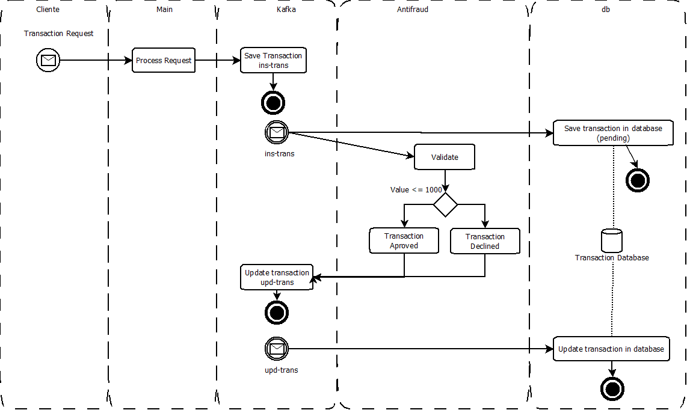

# Yape Code Challenge 🚀

# About the Software

The application run over a Event-Driven and microservices architectures. 

Components:
* Main service, is the microservice that provide de endpoint to access to the software
* Antifraud server, is the service consumer and producer whose objective is to review transactions for fraud.
* DB server, is the service consumer to register and update transaction in the database (Redis). 
* Redis, is the database (memory) of the Transactions.
* Kafka, is the distributed event streaming.
* Zookeeper, is the central of configuration of Kafka.

## Process 




## Extra challenges
About Huge amount of writes and reads.
* We used microservice architecture for break down the application into smaller, independent services that can be scaled horizontally.
* We used redis only for transactions, it partitioning and distributed the data into smaller,  more manageable pieces called shards to spread the load and reduce bottlenecks.
* Redis suport cluster sharding for divide the write and reads of database in multiple servers.
* Redis run as memory database, with a support persistence in disk, configurated to 20 minutes.
* We used event driven architecture for asynchronous processing which helps in absorbing sudden spikes in load.

# Instalation:

## Requirements:
The application require:

* Docker compose 

## Run the software:

If you run in production environment execute ./run.sh (linux) or run.bat (windows).

If you run in devevelop environment execute ./run-dev.sh (linux) or run-dev.bat (windows).

## Test 

Using a Restful client send POST to http://localhost/transaction the next body with content-type application/json:
```json 
{
  "accountExternalIdDebit": "123",
  "accountExternalIdCredit": "345",
  "tranferTypeId": 1,
  "value": 2000
}
```

Example using curl 
```sh
curl --location 'http://localhost/transaction' \
--header 'Content-Type: application/json' \
--data '{
  "accountExternalIdDebit": "123",
  "accountExternalIdCredit": "345",
  "tranferTypeId": 1,
  "value": 2000
}
'
```

* In the logs of the containers: main, db and antifraud, you can see the information producer and consumer in Kafka. 

The check the data recorder in database:
* Access to redis container and execute "redis-cli";
* In redis-cli get the list of transaction with the command: keys *
* Identify the last ID with format "TR-XXXX-XXX"
* In redis-cli get the data or the record with the command: get "TR-XXXX-XXX"


